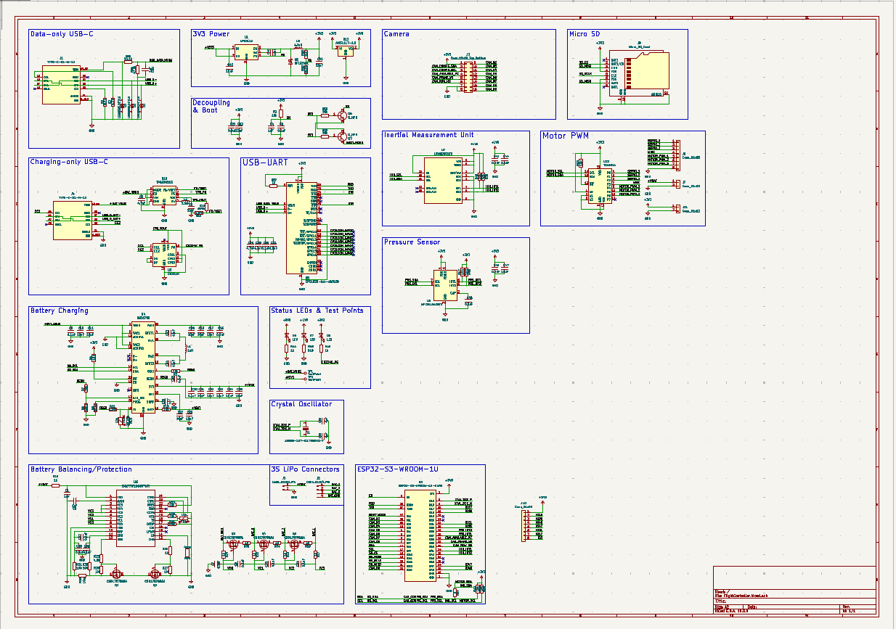
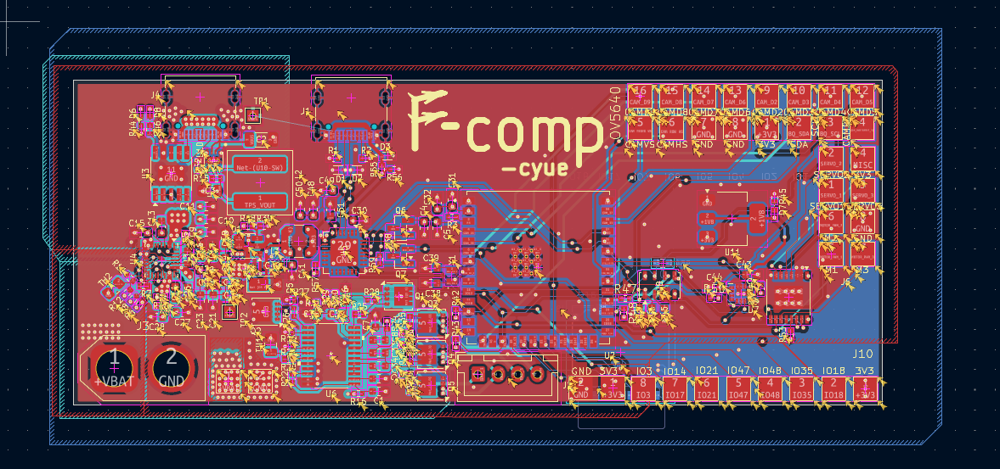
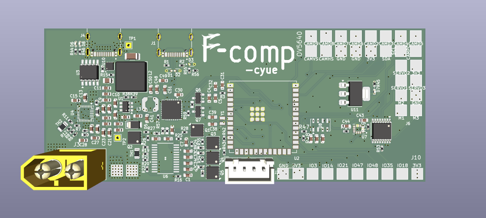

<h1>Custom Flight Controller</h1>

<h3>What is it?</h3>

This is a custom flight controller with onboard LiPo charging capabilities and buck converters for 3V bus as well as support for 6 external motors (3 DC, 3 servo) and 7-pin breakout for external sensor array. USB-UART bus for uploading firmware via serial. Internal power paths for limited high-current motor handling; however most motor wiring will most likely have to be done externally due to PCB limitations.

<h3>Why did I make this?</h3>

Flight has always been something that has fascinated me and so far my only experience has been with assembling premade drone kits or glider kits. I want to be able to go out and fly something that I made essentially from scratch. I have this vision of myself standing on the roof, tossing the plane off, and watching it fly up into the sky, and then looking at the camera feed to see the world from up high.

<h3>Main components/features</h3>
<ol>
  <li>ESP32-S3-WROOM-1U - Central processor</li>
  <li>BMS management circuitry; computer is powered by 3S LiPo battery</li>
  <li>IMU (6-axis; accelerometer/gyroscope)</li>
  <li>Pressure sensor (for altitude)</li>
  <li>OV5640 Camera (external)</li>
  <li>Miscellaneous: external 2.4ghz antenna capability; dual USB-C for charging/data; external microSD support</li>
</ol>

<h3>Firmware brief description</h3>
- Modular handling of all sensors with interrupts configured to save battery power
- Verbose error/initialization logging to detect I2C issues
- Ability to log data to microSD card

<h3>Images</h3>

<h3>External sources (for the LSM6DSOX firmware libraries)</h3>

[Base LSM6DS Adafruit library](https://github.com/adafruit/Adafruit_LSM6DS/blob/master/examples/adafruit_lsm6ds_unifiedsensors/adafruit_lsm6ds_unifiedsensors.ino)

### Dependencies of this library:

[Adafruit_BusIO](https://github.com/adafruit/Adafruit_BusIO/tree/master)

[Adafruit_Sensor](https://github.com/adafruit/Adafruit_Sensor/tree/master)

<h3>BOM</h3>

::TODO::
